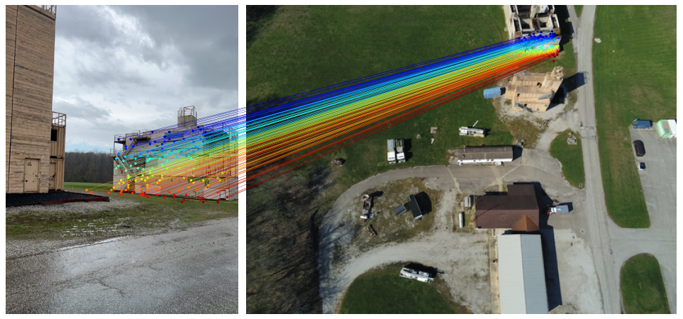

<div align="center">

# AerialMegaDepth: Learning Aerial-Ground Reconstruction and View Synthesis

[Khiem Vuong](https://www.khiemvuong.com/), [Anurag Ghosh](https://anuragxel.github.io/), [Deva Ramanan*](https://www.cs.cmu.edu/~deva), [Srinivasa Narasimhan*](https://www.cs.cmu.edu/~srinivas), [Shubham Tulsiani*](https://shubhtuls.github.io/)

(* denotes equal contribution/advising)

[[`arXiv`](https://arxiv.org/abs/XXXX.XXXXX)]
[[`Project Page`](https://aerial-megadepth.github.io/)]
[[`Bibtex`](#reference)]

${{\color{RoyalBlue}\Huge{\textsf{  CVPR\ 2025\ \}}}}\$

</div>

## Table of Contents

- [Installation](#installation)
- [Quick Start](#quick-start)
- [Evaluation](#evaluation)
- [Data Generation](#data-generation)
- [Acknowledgement](#acknowledgement)
- [Reference](#reference)
- [Issues](#issues)

## Installation

Below are the setup instructions (mostly following [MASt3R repo](https://github.com/naver/mast3r)). We follow the MASt3R setup since it encapsulates DUSt3R, but both should work similarly.


1. Clone the repository:
```bash
git clone --recursive https://github.com/kvuong2711/aerial-megadepth.git
cd aerial-megadepth/mast3r

# If you already cloned the repository, you can update the submodules:
# git submodule update --init --recursive
```
2. Create environment and install dependencies:
```bash
conda create -n aerialmd python=3.11 cmake=3.14.0
conda activate aerialmd 
conda install pytorch torchvision pytorch-cuda=12.1 -c pytorch -c nvidia  # use the correct version of cuda for your system
pip install -r requirements.txt
pip install -r dust3r/requirements.txt
pip install -r dust3r/requirements_optional.txt
```
3. Optional, compile the cuda kernels for RoPE (as in CroCo v2):
```bash
# DUST3R relies on RoPE positional embeddings for which you can compile some cuda kernels for faster runtime.
cd dust3r/croco/models/curope/
python setup.py build_ext --inplace
cd ../../../../
```

## Quick Start
Our finetuned checkpoints are fully compatible with the original DUSt3R/MASt3R/MASt3R-SfM codebase - if you already have them set up, you can simply swap the checkpoint for aerial-ground scenarios!

### Checkpoints

To download the DUSt3R and MASt3R checkpoint finetuned on our AerialMegaDepth dataset:

```bash
# you are inside aerial-megadepth/mast3r
mkdir -p checkpoints/
wget https://aerial-megadepth.s3.us-east-2.amazonaws.com/cvpr2025_checkpoints/checkpoint-aerial-dust3r.pth -P checkpoints/
wget https://aerial-megadepth.s3.us-east-2.amazonaws.com/cvpr2025_checkpoints/checkpoint-aerial-mast3r.pth -P checkpoints/
```

### Inference/Demo
We provide a few example images in the [assets](assets) folder for quick testing, including images from [ULTRRA challenge](https://sites.google.com/view/ultrra-wacv-2025).

Each script (e.g., [demo_dust3r_nongradio.py](mast3r/demo_dust3r_nongradio.py)) contains predefined image paths to demonstrate typical use cases. You can modify the `image_list` variable inside the script to try different pairs. You can run inference using the following commands:

- DUSt3R demo code:
```bash
python demo_dust3r_nongradio.py --weights checkpoints/checkpoint-aerial-dust3r.pth
```

- MASt3R demo code:
```bash
python demo_mast3r_nongradio.py --weights checkpoints/checkpoint-aerial-mast3r.pth
```


## Evaluation
First, download the evaluation data and unzip it:
```bash
aws s3 sync s3://aerial-megadepth/eval_data_release.zip ./
mkdir -p data/
unzip eval_data_release.zip -d data/
```

Then, run the evaluation script:
```bash
python eval.py \
    --weights checkpoints/checkpoint-aerial-dust3r.pth \
    --eval_data_dir data/eval_data_release
```
This script (adapted from [PoseDiffusion](https://github.com/facebookresearch/PoseDiffusion)) reports RRA and RTA at thresholds of 5°, 10°, 15°, and 30°.

## Data Generation
For instructions on how to download and/or generate the data, please refer to [data_generation](data_generation).

## Acknowledgement
This codebase is inspired by and built upon many awesome works, such as [MegaDepth](https://www.cs.cornell.edu/projects/megadepth), [DUSt3R](https://github.com/naver/dust3r), [hloc](https://github.com/cvg/Hierarchical-Localization), [COLMAP](https://github.com/colmap/colmap), etc.

## Reference
If you find our work to be useful in your research, please consider citing our paper:

```bibtex
@inproceedings{vuong2025aerialmegadepth,
  title={AerialMegaDepth: Learning Aerial-Ground Reconstruction and View Synthesis},
  author={Vuong, Khiem and Ghosh, Anurag and Ramanan, Deva and Narasimhan, Srinivasa and Tulsiani, Shubham},
  booktitle={Proceedings of the IEEE/CVF Conference on Computer Vision and Pattern Recognition},
  year={2025},
}
```

## Issues
If you have any problem/question/suggestion, feel free to create an issue or reach out directly to me via [email](mailto:kvuong@andrew.cmu.edu).